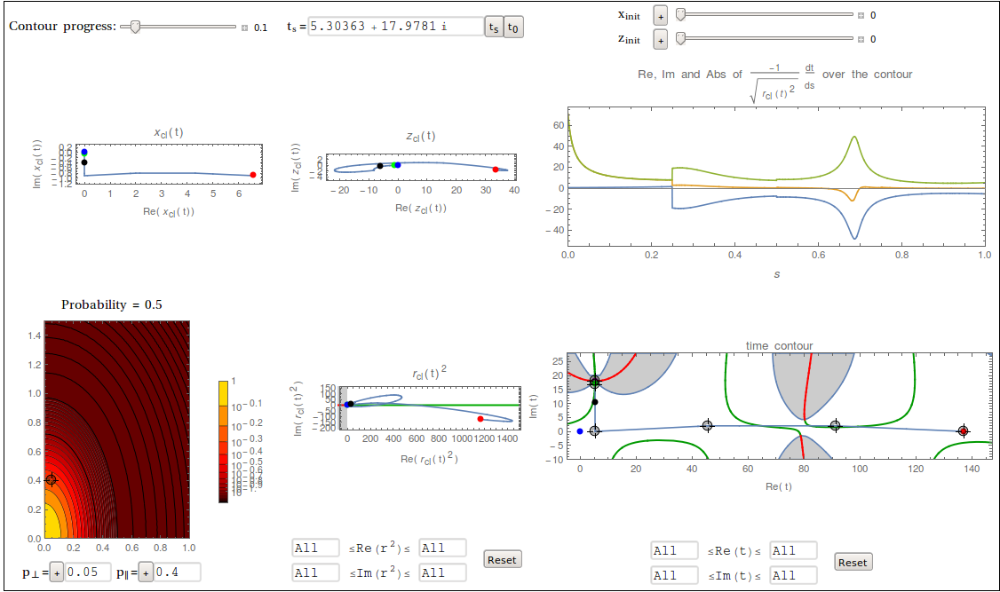

# QuODD: 
###Quantum Optics Dynamic Dashboard

The Quantum Optics Dynamic Dashboard is a Mathematica package to aid in the visualization of the complex-valued trajectories that arise in the theory of optical tunnelling - i.e., the ionization of atoms by strong, low-frequency laser fields by means of the tunnel effect.

The Dashboard requires Wolfram Mathematica to view and modify, and it can be viewed and interacted with (but not modified) with the free-to-download [Wolfram CDF Player](http://www.wolfram.com/cdf-player/).

To get the Dashboard, download the ZIP file from the bar on the right and unpack its contents onto a folder. Then use Mathematica to open `Quantum Optics Dynamic Dashboard.nb` or open `Quantum Optics Dynamic Dashboard.cdf` with the CDF player.

A sample Dashboard looks as follows:

This application consists of the following files:

 - `Quantum Orbits Dynamic Dashboard.nb` contains documentation for the Dashboard and a number of examples. The corresponding `.cdf` file can be opened using the free-to-download [Wolfram CDF Player](http://www.wolfram.com/cdf-player/); the `.pdf` file has a printout of the notebook.
 - `QuODD.m` contains the Mathematica package `QuODD`, with the functions required to produce the Dashboard.
 - `ARMSupport.m` is a support package with functions which implement the analytical *R*-matrix theory of photoionization.
 - `EPToolbox.m` is a support package with general-use functions.

All `.m` package files are generated automatically from the corresponding `.nb` files (by saving them inside Mathematica), which are better documented. The `.pdf` files are printouts of the package notebooks.

-----

This software was developed as an aid for the research presented in

> Slalom in complex time: emergence of low-energy structures in tunnel ionization via complex time contours. E. Pisanty and M. Ivanov. In preparation.

and it is also documented in

> Quantum Orbit Dynamic Dashboard: a navigation tool for complex time and complex space in tunnel ionization. E. Pisanty. In preparation.

If this software is useful for your research, please cite either or both papers, or cite this software directly. An example citation is

> E. Pisanty. QuODD: Quantum Orbits Dynamic Dashboard. https://github.com/episanty/QuODD (2015).

---

This software is available under the MIT license, with the exception of the file `Quantum Orbits Dynamic Dashboard.cdf`, which is licensed under the Creative Commons Attribution-ShareAlike (CC BY-SA) license due to restrictions of that format.